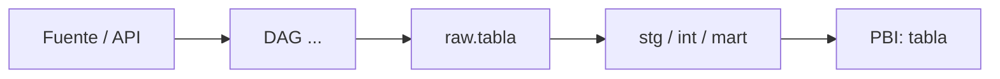

# Lineage: <objeto> (<reporte PBI> → origen)

**Dominio:** · **Última verificación:** YYYY-MM-DD · **Verificado por:** Ivan + Claude

## Resumen
<2-3 líneas: de dónde viene, quién lo puebla, cada cuánto>

## Flujo

## Paso a paso
| Capa | Objeto | Archivo / ubicación | Transformación |
|---|---|---|---|
| Fuente | | | |
| ETL (DAG) | | nexus/airflow/dags/... | |
| Raw | | | |
| dbt / vista | | nexus/dwh/models/... | |
| Power BI | | Power Query: ... | |

## Frecuencia y dependencias
- Schedule del DAG:
- Depende de:

## Cuidado con
-

## Queries relacionadas
-
